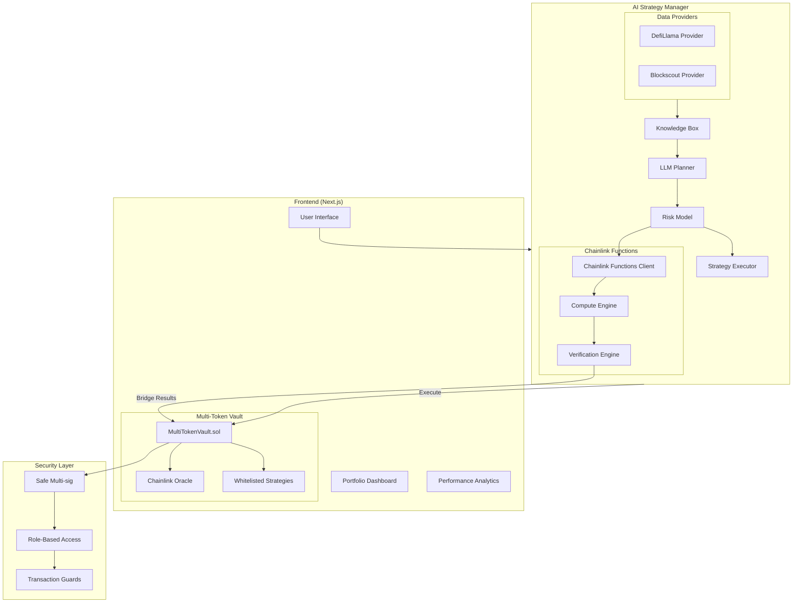

# ⚔️ Shōgun: AI-Powered DeFi Super Vaults

> **Advanced DeFi vault system with AI-driven strategy execution and multi-chain yield optimization**

## 🚀 Quick Start

```bash
# Install dependencies
npm install

# Start development server
npm run dev

# Open http://localhost:3000
```

## 📋 Overview

Shōgun is a sophisticated DeFi protocol that combines traditional vault functionality with AI-driven strategy execution. The system allows users to deposit multiple ERC20 tokens into vaults while AI agents automatically optimize yield through whitelisted strategies including swaps, lending, and other DeFi protocols.

### 🔒 Security First

- **Funds never leave the protocol**: AI agents can only execute pre-approved strategies within the smart contract ecosystem
- **Whitelisted strategies only**: Only admin/manager approved strategies can be executed
- **Role-based access control**: Clear separation between users, managers, and agents
- **Non-custodial**: Users maintain full ownership of their assets
- **Multi-signature security**: Safe integration for secure transaction approval

## 🏗️ System Architecture



## 🌐 Live Deployment

Shōgun is currently live on Avalanche mainnet with active DeFi strategies automatically allocating capital based on AI-driven analysis.

**Live Demo:** [https://vault-web-eta.vercel.app/](https://vault-web-eta.vercel.app/)

### Repository Structure

* **Frontend (This Repo):** Web interface and user experience
* **AI Strategy Manager:** [strategies-ai-avalanche](https://github.com/lausuarez02/strategies-ai-avalanche/)
* **Agent Implementation:** [strategies-agent-avalanche](https://github.com/lausuarez02/strategies-agent-avalanche/)
* **Smart Contracts AI:** [strategies-contracts-avalanche](https://github.com/lausuarez02/strategies-contracts-avalanche/)
* **Smart Contracts Investing:** [contracts-avalanche](https://github.com/lausuarez02/strategies-contracts-avalanche/)

## 🛠️ Tech Stack

### Frontend
- **Next.js 15** - React framework for production
- **TailwindCSS** - Utility-first CSS framework
- **shadcn/ui** - Reusable component system
- **Studiofreight Hamo** - Animation libraries
- **Lenis scroll** - Smooth scrolling
- **Spline 3D** - 3D objects rendering
- **RainbowKit** - Wallet connection interface
- **Wagmi** - React Hooks for Ethereum

### Blockchain & Security
- **Safe** (formerly Gnosis Safe) - Multi-signature wallet infrastructure
- **Viem** - TypeScript Ethereum library
- **Avalanche Mainnet** - Deployment chain
- **USDC.e** - Stablecoin integration
- **Chainlink Functions** - Verifiable offchain computation
- **Chainlink Oracles** - Reliable price feeds

### AI/ML Components
- **Custom AI Agent** (Shōgun Council) for:
  - Market analysis and yield optimization
  - Protocol risk profiling with Allora Network
  - Cross-chain strategy execution
  - Real-time portfolio rebalancing

### Partner Integrations
- **deBridge** - Cross-chain transaction execution
- **Allora Network** - Decentralized intelligence for risk assessment

## 🎯 Key Features

### Multi-Token Vault System
- **Multi-token support**: USDC, WBTC, WETH, LINK with Chainlink oracle pricing
- **Automatic conversion**: Real-time price feeds for accurate USDC equivalent
- **Advanced management**: Precise multi-asset management with oracle integration

### AI-Driven Strategy Execution
- **LLM-based planning**: Intelligent strategy generation using advanced language models
- **Risk assessment**: Multi-layered risk scoring with Allora Network integration
- **Automated execution**: AI agents execute pre-approved strategies through secure interfaces
- **Performance optimization**: Continuous monitoring and rebalancing for maximum yields

### Security & Governance
- **Multi-signature transactions**: Safe integration for secure transaction approval
- **Role-based access control**: Clear separation between users, managers, and agents
- **Whitelisted strategies**: Only pre-approved contracts can execute
- **Emergency mechanisms**: Automatic response to unusual events
- **Time-locked operations**: Critical changes require time delays

### Chainlink Functions Integration
- **Strategy Risk Scoring**: Offchain ML model inference with verifiable proofs
- **Cross-Chain APY Aggregation**: Multi-chain data fetching and analysis
- **Vault Allocation Optimization**: Complex optimization algorithms with cryptographic verification
- **Oracle Health Monitoring**: Real-time Chainlink oracle health checks

## 📁 Project Structure

```
📁 vault-web/
├── 📂 app/                    # Next.js app directory
│   ├── 📂 components/         # React components
│   ├── 📂 council/           # Council page
│   ├── 📂 presentation/      # Presentation page
│   └── layout.tsx            # Root layout
├── 📂 components/            # Shared components
│   ├── 📂 ui/               # shadcn/ui components
│   ├── 📂 vault/            # Vault-specific components
│   ├── 📂 home/             # Home page components
│   └── 📂 presentation/     # Presentation components
├── 📂 hooks/                # Custom React hooks
├── 📂 libs/                 # Utility libraries
├── 📂 styles/               # Global styles and SCSS
├── 📂 public/               # Static assets
│   ├── 📂 images/           # Images and logos
│   ├── 📂 video/            # Demo videos
│   └── 📂 fonts/            # Custom fonts
└── 📂 types/                # TypeScript type definitions
```

## 🔗 Chainlink Integration Files

This project integrates Chainlink in multiple ways to enable state changes on the blockchain. Here are all the files that use Chainlink:

### Smart Contract Integration
- **[constants/index.ts](constants/index.ts)** - Contains the vault ABI with Chainlink oracle integration, including:
  - `AggregatorV3Interface` price feed contracts
  - `configureToken()` function for setting up Chainlink price feeds
  - `previewTokenDeposit()` function that uses oracle prices for token conversion
  - `TokenConfigured` events for oracle setup

### Frontend Components Using Chainlink Data
- **[components/Vault.tsx](components/Vault.tsx)** - Main vault interface that interacts with Chainlink-powered smart contracts
- **[components/modals/index.jsx](components/modals/index.jsx)** - Modal for token deposits using Chainlink price feeds
- **[components/sections/vault-action-cards.jsx](components/sections/vault-action-cards.jsx)** - Displays vault stats from Chainlink oracle data
- **[components/sections/features.jsx](components/sections/features.jsx)** - Shows real-time vault performance using Chainlink data

### AI Strategy Manager (External Repository)
- **[shogun-ai-core](https://github.com/lausuarez02/shogun-ai-core)** - Contains Chainlink Functions integration:
  - Strategy risk scoring with verifiable offchain computation
  - Cross-chain APY aggregation using Chainlink Functions
  - Vault allocation optimization with cryptographic verification
  - Oracle health monitoring across networks

### Smart Contracts (External Repository)
- **[strategies-ai-vaults](https://github.com/tomi204/ai-vaults/)** - Contains the MultiTokenVault.sol contract with:
  - Chainlink oracle integration for real-time price feeds
  - Multi-token support (USDC, WBTC, WETH, LINK) with oracle pricing
  - Staleness protection and data validation
  - Automatic token conversion to USDC equivalent

### Chainlink Features Used
1. **Chainlink Data Feeds**: Real-time price data for BTC/USD, ETH/USD, LINK/USD
2. **Chainlink Functions**: Offchain computation for AI strategy optimization
3. **Oracle Integration**: Multi-token vault with automatic price conversion
4. **Data Validation**: Staleness protection and invalid data prevention

All Chainlink integrations enable state changes on the blockchain through smart contract execution, making this project eligible for Chainlink hackathon prizes.

## 🚀 Getting Started

### Prerequisites
- Node.js 18+ 
- npm, yarn, pnpm, or bun
- MetaMask or compatible wallet
- Avalanche mainnet network configured

### Installation

```bash
# Clone the repository
git clone https://github.com/lausuarez02/vault-web.git
cd vault-web

# Install dependencies
npm install

# Configure environment (if needed)
cp .env.example .env
# Edit .env with your configuration

# Start development server
npm run dev
```

Open [http://localhost:3000](http://localhost:3000) with your browser to see the result.

### Available Scripts

```bash
# Development
npm run dev          # Start development server
npm run build        # Build for production
npm run start        # Start production server

# Linting and formatting
npm run lint         # Run ESLint
npm run format       # Format code with Prettier

# Type checking
npm run type-check   # Run TypeScript compiler
```

## 💡 How It Works

### 1. **Multi-Token Deposits**
Users can deposit supported ERC20 tokens (USDC, WBTC, WETH, LINK) into the vault. The system automatically:
- **Fetches real-time prices** from Chainlink oracles
- **Converts token values** to USDC equivalent
- **Mints vault shares** proportional to the deposited value
- **Maintains accurate accounting** of all deposited assets

### 2. **AI Strategy Generation**
The Shōgun Council AI agent:
- **Analyzes market conditions** using real-time data from DefiLlama and Blockscout
- **Generates optimal strategies** using LLM-based planning
- **Assesses risk** through multi-layered risk models
- **Executes approved strategies** through whitelisted contracts

### 3. **Chainlink Functions Integration**
- **Strategy Risk Scoring**: Offchain ML model inference with verifiable proofs
- **Cross-Chain APY Aggregation**: Multi-chain data fetching and analysis
- **Vault Allocation Optimization**: Complex optimization algorithms with cryptographic verification

### 4. **Automated Yield Optimization**
The AI continuously monitors and rebalances positions to maximize returns while maintaining risk parameters optimized for Avalanche's fast and low-cost environment.

### 5. **Secure Fund Management**
- Funds never leave the smart contract ecosystem
- All strategies are pre-approved by governance
- Emergency exit mechanisms available
- Transparent on-chain execution

## 🔐 Security Features

### Role-Based Access Control
| Role        | Permissions                             |
| ----------- | --------------------------------------- |
| **User**    | Deposit, withdraw, redeem shares        |
| **Manager** | Add/remove strategies, configure tokens |
| **Agent**   | Execute strategies, harvest rewards     |
| **Admin**   | Grant/revoke roles, emergency functions |

### Multi-Signature Security
Our vault system utilizes Safe's multi-signature infrastructure to:
- **Secure high-value transactions** with multiple approvals
- **Implement time-locks** for significant changes
- **Enable collective governance** through multi-sig requirements
- **Manage access control** with granular permissions

### Strategy Whitelisting
- Only pre-approved strategies can be executed
- Strategies undergo security audits
- Community governance for strategy approval
- Emergency pause mechanisms

### Chainlink Oracle Integration
- **Decentralized price feeds** from Chainlink's proven oracle network
- **Staleness protection** with configurable maximum age limits
- **Data validation** prevents invalid or zero price data
- **High availability** with reliable infrastructure

## 📊 Market Position

Shōgun uniquely occupies the high-yield + passive management quadrant in the DeFi landscape:
- **Delivers Morpho-level yields** with Superform-level passivity
- **Combines active management returns** with passive user experience
- **Uses AI to bridge the gap** between yield and convenience
- **Leverages Chainlink Functions** for verifiable offchain computation

## 🎮 User Experience

### Dashboard Features
- **Real-time portfolio monitoring** with live performance tracking
- **Interactive vault management** for deposits and withdrawals
- **Performance analytics** with historical data visualization
- **Strategy transparency** showing current allocations and yields

### Presentation Mode
- **Professional presentation slides** for demonstrations
- **Keyboard navigation** (arrow keys or spacebar)
- **Interactive diagrams** explaining the system architecture
- **Live demo integration** with actual vault data

## 🔍 Monitoring & Analytics

### Real-Time Monitoring
Shōgun monitors:
- Vault performance metrics
- Strategy execution status
- Oracle price feeds
- Liquidity events
- Volume spikes
- Rate changes
- Protocol health metrics
- Smart contract events
- Market conditions
- Chainlink Functions task status
- Oracle health across networks
- Cross-chain data integrity

### Performance Tracking
- **APY calculations** with compound interest
- **Risk-adjusted returns** using Sharpe ratios
- **Portfolio diversification** metrics
- **Gas optimization** tracking
- **Cross-chain performance** comparison

## 🛠️ Development

### Local Development
```bash
# Start development server
npm run dev

# Run tests
npm test

# Build for production
npm run build

# Start production server
npm run start
```

### Environment Configuration
Create a `.env.local` file for local development:
```env
# Optional: Add any environment variables needed for development
NEXT_PUBLIC_CHAIN_ID=1
NEXT_PUBLIC_RPC_URL=https://mainnet.infura.io/v3/YOUR_PROJECT_ID
```

### Contributing
1. Fork the repository
2. Create a feature branch: `git checkout -b feature/amazing-feature`
3. Make your changes and add tests
4. Ensure all tests pass: `npm test`
5. Submit a pull request

## 🚨 Troubleshooting

### Common Issues

**Wallet Connection Issues**
- Ensure MetaMask is installed and unlocked
- Check that Avalanche mainnet is added to your wallet
- Verify you have sufficient gas for transactions

**Transaction Failures**
- Check gas prices and network congestion
- Ensure you have sufficient token balance
- Verify transaction parameters are correct

**Performance Issues**
- Clear browser cache and cookies
- Check network connectivity
- Restart the development server

## 📄 License

This project is licensed under the MIT License - see the LICENSE file for details.

- [Chainlink Functions Documentation](https://docs.chain.link/chainlink-functions)

## 🌟 Join the Community

Join the AI Ronin Council. Propose strategies. Stake your honor. Maximize yield.

**Ready to experience AI-powered DeFi on Avalanche!** ⚔️

